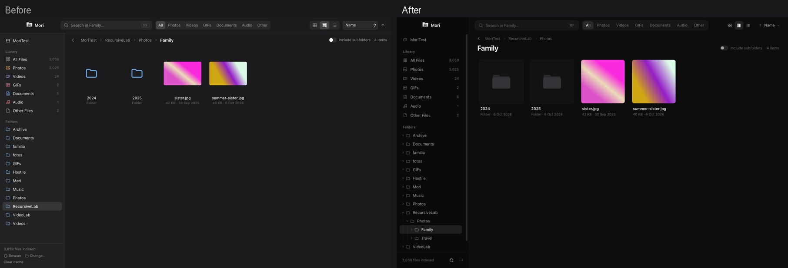

<p align="center">
  <picture>
    <source media="(prefers-color-scheme: dark)" srcset="assets/branding/mori-icon-white.png">
    
  </picture>
</p>

<h1 align="center">Mori</h1>

<p align="center">
  A private, offline media and file browser for inspecting local folders and external drives.
</p>

---

Mori is a small desktop app for looking through folders and drives, including ones you don't trust. It browses them like a Finder-style gallery, and it previews photos, videos, PDFs and archives without handing the originals to other apps. It also finds duplicates, reads and scans metadata, checks file integrity, and shows what takes up space.

It has no account, no cloud, no telemetry and no network functionality.



## Four pillars

- **Privacy.** Your files and what Mori learns about them stay on your computer. No account, login, cloud service, telemetry, analytics or remote processing. **Privacy & Local Data** lists everything Mori stores, with sizes, and clears it selectively or resets Mori entirely.
- **Security.** Mori treats every file as untrusted input:
  - the content decides what a file is, never the extension;
  - decoding happens in a separate worker process that the OS sandbox denies file and network access, and only re-encoded copies reach the interface;
  - archives are listed, never extracted;
  - links are never followed.
- **Offline.** Browsing, search, previews, analyses, metadata, checksums and integrity checks all work without an internet connection. The interface's Content-Security-Policy refuses every remote origin, and the decoder workers are denied network access by the OS sandbox. The main process has no network code, but it isn't sandboxed from the network: this is a property of the code, not an OS-enforced barrier.
- **Ephemeral inspection.** **Temporary Session** and **Private Inspection** keep everything they produce in memory, refuse to save records, and clear it all when the session ends. An automated test checks that a session leaves nothing in Mori's own data.

**Diagnostics** shows which of these protections are verified on your installation right now. It runs a self-test on synthetic files and shows no hard-coded check marks.

## What it does

- **Browse.** Gallery, Grid and List views; search across a folder, its subfolders or the whole drive; filters for photos, videos, GIFs, documents, audio, screenshots and screen recordings.
- **Preview safely.** Images (including HEIC on macOS), GIFs, video with a filmstrip, audio with a waveform, PDF pages rendered as bitmaps, and archive listings. **Open in Isolation** shows only worker-made copies.
- **Inspect.** The real file type and risk indicators (disguised executables, double extensions, hidden characters), permissions, and metadata: EXIF, XMP, IPTC, QuickTime and ID3.
  - **Sensitive Metadata** finds location, device and personal fields across a drive.
  - **Places** shows positions on an offline map.
  - **Sanitized copies** have their metadata removed.
- **Analyze.**
  - **Exact Duplicates** by content hash, and **Similar Media** by perceptual comparison, with Compare and Difference views and a suggested best copy.
  - **Storage** with a treemap.
  - **Media Health:** broken, unsupported and risk-flagged media.
  - **Empty Folders.**
- **Integrity.** SHA-256 checksums, **Compare Integrity** for two files, and opt-in folder **integrity snapshots**. Verifying a snapshot reports *Unchanged*, *Changed*, *Missing* and *New*.
- **Protect.**
  - **Read-only Mode** and **Never Modify** folders are enforced in the backend.
  - **Private folders** keep their contents out of views, search and analyses started outside them.
  - **Safe Inspection Mode** indexes new drives without decoding anything.
  - **Private Inspection** combines read-only, temporary and safe inspection in one step.
- **Organize.** Tags and favorites, stored in Mori's own data and never in your files.
- **Manage files like a file browser.** Click to select, Cmd/Ctrl/Shift for multi-selection, double-click to open; **Move to…** and **Copy to…** with a conflict plan (Keep Both / Replace into the Trash / Skip, never a silent overwrite); actions from the preview too.
- **Quick Cleanup.** Go through a folder one file at a time with the keyboard: Keep or Mark for Trash. Marking only stages a decision; files move to the system Trash after you review them and confirm once.
- **Change files carefully.**
  - Rename, Move to Trash, and Undo.
  - **Delete Permanently** shows an Operation Preview first, and folders or large batches require typing DELETE.

Every feature is described in [docs/features.md](docs/features.md).

## Install

Download the file for your system from the [Releases](../../releases) page, plus `SHA256SUMS.txt` if you want to check the download (`shasum -a 256 -c SHA256SUMS.txt --ignore-missing` on macOS and Linux).

| System | File |
|---|---|
| macOS, Apple Silicon | `Mori_<version>_macOS_arm64.dmg` |
| macOS, Intel | `Mori_<version>_macOS_x64.dmg` |
| Windows 10/11 (x64) | `Mori_<version>_Windows_x64-setup.exe` or `.msi` |
| Linux (x64) | `Mori_<version>_Linux_x64.AppImage` or `.deb` |

**Mori isn't signed with a publisher certificate yet**, so each system warns once. Never disable Gatekeeper, SmartScreen or any other protection to run it.

- **macOS:**
  1. Open the DMG and drag **Mori** into **Applications**.
  2. The first launch shows *"Apple could not verify “Mori” is free of malware…"*.
  3. On macOS 15 and later, click **Done**, then **System Settings → Privacy & Security → Open Anyway**, and confirm. On macOS 14 and earlier, Control-click Mori → **Open** → **Open**.
- **Windows:**
  1. Run the installer.
  2. SmartScreen shows *"Windows protected your PC"* (Unknown publisher): click **More info → Run anyway**.
  3. If Microsoft Edge WebView2 is missing (Windows 11 includes it), the installer downloads it from Microsoft.
- **Linux:**
  - **AppImage:** `chmod +x` it and run it. It needs FUSE 2: `libfuse2` on Ubuntu 22.04, `libfuse2t64` on 24.04.
  - **Debian/Ubuntu:** `sudo apt install ./Mori_<version>_Linux_x64.deb`.
  - **Video and audio** need the system's GStreamer plugins.

**Portable use:** Mori can also run from an external drive (for example `Drive/Mori/Mori.app`). It then opens that drive automatically.

## Security model

Mori is built to reduce the impact of hostile files:
- malformed or oversized images;
- crafted video containers;
- hostile PDFs;
- archive traversal and bombs;
- disguised extensions and deceptive names;
- symlink tricks.

Its defences:
- **Decoder workers** receive bytes, never paths. They run under resource limits and, on macOS, the system sandbox.
- **PDFs** are rasterised with nothing interactive.
- **A backend mutation policy** gates every change to your files.

Mori is **not antivirus software**, and it never says a file is "safe". It cannot protect against vulnerabilities in the operating system or its media engine, and no sandbox is an absolute guarantee. See [SECURITY.md](SECURITY.md) and [docs/security.md](docs/security.md).

## Limitations

- Mori minimises its own stored data but can't remove traces created outside it:
  - file-system journals;
  - swap and memory compression;
  - APFS or Time Machine snapshots and other backups;
  - system crash reports;
  - SSD wear-levelling;
  - Spotlight;
  - third-party monitoring software.

  It is not an anonymity or anti-forensics tool.
- Video and audio are played by the system's own media engine, which is outside Mori's sandbox.
- HEIC previews, PDF previews, new-drive detection and Undo for Trash are macOS-only.
- Similar Media is probabilistic: review its suggestions before removing anything.
- See [docs/features.md](docs/features.md#not-implemented-yet) for what isn't implemented.

## Data stored on your computer

Mori writes to a browsed drive only when you explicitly ask it to: rename, move, copy, Trash, a sanitized copy, or a confirmed permanent deletion.

| | macOS | Windows | Linux |
|---|---|---|---|
| App data (settings, indexes, records, snapshots) | `~/Library/Application Support/app.mori.viewer/` | `%APPDATA%\app.mori.viewer\` | `~/.local/share/app.mori.viewer/` |
| Cache (thumbnails, fingerprints) | `~/Library/Caches/app.mori.viewer/` | `%LOCALAPPDATA%\app.mori.viewer\` | `~/.cache/app.mori.viewer/` |
| Preferences (window state) | `~/Library/Preferences/app.mori.viewer.plist` | — | — |
| Temporary files | none; temporary sessions stay in memory | none | none |
| Logs | none in release builds | none | none |

[docs/privacy.md](docs/privacy.md) is the complete inventory: what each item is, why it exists, when it is deleted and what it can reveal.

**To uninstall:**
1. Use **Privacy & Local Data → Reset Mori…**.
2. Delete Mori.app.

Alternatively, delete the app and the folders above.

## Platforms

| Platform | Status |
|---|---|
| **macOS, Apple Silicon** | Supported. Tested by hand on macOS 26, plus the automated tests. The declared minimum is macOS 11; older versions haven't been tested. |
| **macOS, Intel** | Built and tested natively in CI. Launched under Rosetta, not yet on Intel hardware. |
| **Windows x64** | Built and unit-tested in CI; not yet tested by hand. Decoder workers have resource limits but no OS sandbox denying them file access. |
| **Linux x64** | Built and tested in CI (unit and worker tests); not yet tested by hand. Workers use resource limits and `no_new_privs`, without seccomp. |

HEIC previews, PDF previews, new-drive detection and Undo for Trash are macOS-only.

## Building from source

Requirements:
- [Node.js](https://nodejs.org) 20+;
- [Rust](https://rustup.rs) stable;
- the [Tauri prerequisites](https://tauri.app/start/prerequisites/).

```bash
npm ci
npm run app:dev      # development mode
npm run app:build    # release bundles in src-tauri/target/release/bundle/
```

Checks:

```bash
npm run typecheck
cd src-tauri
cargo fmt --check
cargo clippy --all-targets -- -D warnings
cargo test           # unit, sandboxed-worker and temporary-session persistence tests
```

Releases are built by GitHub Actions when a version tag is pushed; see [docs/releasing.md](docs/releasing.md).

## Project layout

```
src/                 React + TypeScript interface
src-tauri/src/       Rust: index and search, path confinement, sandboxed worker,
                     mori:// protocol, analyses, integrity, diagnostics, file operations
src-tauri/tests/     sandboxed-worker, persistence and version tests
assets/branding/     Mori marks and the macOS app icon master
scripts/             build-icons.py: regenerates every icon from the branding artwork
docs/                feature reference, security and privacy notes, releases, screenshots
```

Mori's mark is a folder with a pixel-art incognito character. All icons are generated from the original artwork by `python3 scripts/build-icons.py`.

## License

No license has been chosen yet.
