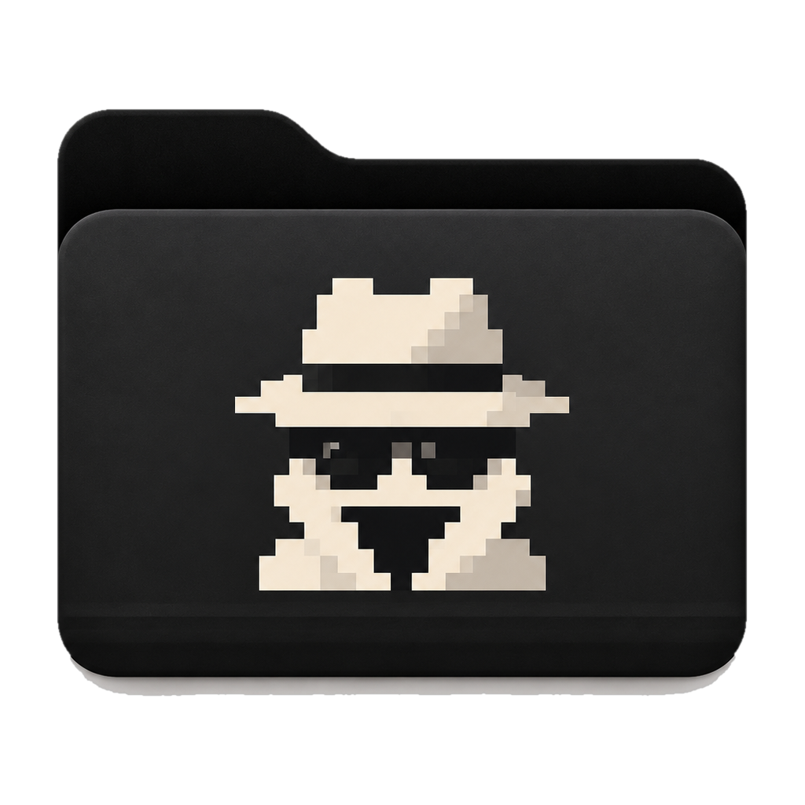

<p align="center">
  <picture>
    <source media="(prefers-color-scheme: dark)" srcset="assets/branding/mori-icon-white.png">
    
  </picture>
</p>

<h1 align="center">Mori</h1>

<p align="center">
  A private, offline-first media and file browser for exploring local and external storage.
</p>

---

Mori is a small desktop app (Tauri + Rust + React) that you can keep on an external drive and open with a double-click. It browses that drive like a Finder-style gallery: no accounts, no cloud, no telemetry, and no network access at all.

## Features

- **Offline-first.** No accounts, no telemetry, no cloud, no update checks, and no network requests.
- **Local file browsing** with folder navigation, breadcrumbs and back history.
- **Gallery, Grid and List views**, virtualized so folders with tens of thousands of files stay smooth.
- **Include subfolders.** View a folder and everything beneath it as one flat list. Filters, search and sorting apply to that combined set, and each file shows where it lives relative to the current folder.
- **Search and filtering.**
  - Instant, case- and accent-insensitive search by name, extension and folder.
  - Two scopes: the current folder (optionally with its subfolders) or the entire drive.
  - Type filters (Photos, Videos, GIFs, Documents, Audio).
  - Sorting by name, date, size or type.
- **Secure media previews** for JPEG/PNG/WebP images and, on macOS, HEIC/HEIF (zoom and pan), animated GIFs, MP4/MOV/WebM video, and plain text.
- **Portable mode.** When run from an external drive, Mori opens that drive automatically. Otherwise it asks for a folder once and remembers it.
- **Local caching and indexing.** A small index and thumbnail cache stay on the computer. **Clear cache** removes them.
- **Light and dark interface** that follows the system setting.
- **Safe file management.**
  - Rename, and **Move to Trash** (the system Trash / Recycle Bin, so items can be restored). Mori has no permanent-delete function.
  - Multi-selection with Cmd/Ctrl+Click and Shift+Click; ⌘⌫ on macOS, Delete on Windows.
  - Several items or a folder ask for confirmation first. Views, search results and the index update immediately.
- **Analyze**: two separate tools that only run when you start them. Both let you choose the locations (the current drive, Home, Pictures, Movies/Videos, Downloads, Documents or any folder you pick) and whether to include subfolders, and both read only the folders you select.

### Exact duplicates

Uses content verification to identify identical files.

- Files are grouped by size, then a partial fingerprint, then a full BLAKE3 hash of the content. Names, dates and visual similarity are never used, and media is never decoded.
- Results are deterministic: every file in a group has exactly the same bytes.

### Similar media

Uses local perceptual analysis to suggest photos and videos that may represent the same media despite different encoding, resolution or metadata: a HEIC and its JPEG export, a WhatsApp copy, a resized or recompressed version, a lightly edited or slightly cropped one, a MOV converted to MP4, a 4K and a 1080p copy, a slightly trimmed clip.

**Similar-media results are probabilistic.** They are estimates shown with an *estimated similarity* (never "identical" unless a full hash confirms it), and every group should be reviewed before cleanup.

- **Photos** are decoded in Mori's sandboxed worker and reduced to small normalized grayscale fingerprints, which are compared with a perceptual hash and then checked region by region. A different subject position, different text in a screenshot or a different scene is enough to reject a match.
- **Videos** are sampled at 12 points by the system video engine (the same guarded path as previews) and compared frame by frame, in order and across the whole clip. A shared intro alone never matches. Trimmed copies get a second, aligned sampling.
- **Strict / Balanced / Broad** sensitivity. Balanced is recommended; Broad finds more edited or cropped versions and more false positives.
- **Review tools:** side-by-side comparison with zoom, Keep all, Keep this one, Ignore (for this session), and **Not duplicates**, which Mori remembers locally by file content, so unchanged files aren't suggested again even if they are renamed or moved.
- Mori suggests the best copy to keep (resolution, original format, camera metadata, compression, derivative-looking names such as "WhatsApp" or "compressed"). It is only a suggestion.
- Fingerprints are cached on this computer per file version. **Clear cache** removes them.

### Both analyzers

- **Live Photos.** A HEIC/JPEG + MOV pair with the same name in the same folder is treated as one item: both halves are kept or trashed together.
- **Review before anything changes.** You pick the copy to keep per group, or auto-select the suggested copies, then confirm in a final review. Only that last step moves files to the Trash.
- **Never removes every copy.** At least one copy of every group is always kept, and this is enforced in the Rust backend, not just the UI. Kept copies are re-checked just before cleanup; if one has changed or its drive is gone, that group is left untouched.
- **Private results.** Results stay in memory and are discarded with **Clear Analysis** or when Mori quits. Nothing is uploaded; there is no cloud vision or remote service of any kind.

### Media intelligence

- **Compare** (Similar Media) shows two copies in three modes, with one shared zoom and pan:
  - **A | B** side by side;
  - **Slider**: A over B, with a draggable divider;
  - **Difference**: the per-pixel |A − B| of the two worker-made previews, amplified, with the share of pixels that differ noticeably.
- **Why this copy?** Both analyzers explain the suggested copy using only differences that actually exist in the group:
  - highest resolution, longest video, Live Photo, original HEIC format, camera metadata kept, least compressed;
  - original-looking name, oldest copy;
  - for exact duplicates, the other copies' Downloads/backup locations or copy-style names.
- **Bursts.** A Similar Media group of three or more photos is marked *Burst · N frames in X s* when every frame comes from the same camera and consecutive shots are at most 1.5 s apart. Capture times come from EXIF, read by the sandboxed worker.
- **Screenshots and Screen Recordings** appear in the Library when present.
  - They are recognised locally from the names systems give them (English, Spanish, French, German, Italian, Japanese, Chinese, Korean and more) and, on macOS, from the system's screen-capture attribute.
  - Wrong guesses can be corrected from the file menu (*Not a Screenshot* / *Mark as Screenshot*). Corrections are remembered per drive and never change the file.


### Analysis Center, storage and media health

- **Analyze** (sidebar heading) opens the Analysis Center: every analysis in one place.
  - Each runs only when started, keeps its results in memory, and changes nothing until you review and confirm.
  - Long scans (Sensitive Metadata, Media Health) can be paused, resumed and cancelled.
- **Storage** is computed instantly from Mori's index, so no file is read:
  - totals by type and by year, and the largest files, videos, images and folders;
  - a treemap of any folder (click to drill down).
  - Private folders are shown as "not measured" and their contents aren't counted.
- **Empty Folders** lists folders without files, topmost only.
  - Each one is re-checked **on disk**, hidden items included, so a folder holding only `.git` isn't "empty". Only system clutter like `.DS_Store` is ignored.
  - Nothing is removed automatically. After review, selected folders go to the **Trash** (re-checked again right before), never deleted permanently.
- **Media Health** checks every photo, video and audio file on the drive. Each file gets at most one result:
  - **Risk-flagged**: the content contradicts the name or extension;
  - **Broken**: empty, truncated, damaged or unrecognisable;
  - **Unsupported**: real media with no safe decoder or player in Mori (RAW/TIFF, AVI, unsupported codecs);
  - **Decode failed**: the sandboxed decoder timed out, crashed or hit a safety limit.
  - Files open isolated from the results.


### Organization

- **Favorites** (files and folders): *Add to Favorites* in the menu, or press `F`. They're listed under Favorites in the sidebar.
- **Tags**: *Tags…* in the menu, for one item or a selection. Items can have several tags.
  - Every tag appears in the sidebar with its count.
  - **Manage Tags** lets you search, rename and delete them. Deleting a tag never touches the tagged files.
  - Favorites and tags live in Mori's app data only. Files and their metadata are never modified.
  - Like private folders, they are stored per volume, so they survive remounts.
- **Browse Without Indexing…** (More menu) opens a folder as a **temporary session**.
  - No index cache, no thumbnails on disk, no fingerprints, no remembered folder, no records. Thumbnails stay in memory.
  - Changes to private/protected/favorite/tag/screenshot records are refused during the session.
  - *End* (sidebar chip) or opening another folder ends it, and nothing is left behind. There is no temporary area to clean up: nothing is written in the first place.
- **Forget This Drive…** removes everything Mori stores about the current drive (all its index caches, its thumbnails, and its private, protected, favorite, tag and screenshot records), then closes it.
  - **Nothing on the drive is deleted or changed.** Deletion is limited to Mori's own app directories by a guard.
  - Tag names are kept.
- **Clear Session Data…** forgets what this session holds in memory: analysis results, folders picked for analysis, recent locations and search. It is distinct from:
  - *Clear Cache* (thumbnails and indexes);
  - *Forget This Drive* (Mori's records about a drive);
  - deleting files, which none of these do.


### Keyboard and viewing

| Key | Action |
|---|---|
| Arrow keys | Move the selection |
| Return | Open the folder or the preview |
| Space | **Mori Quick Look**: a floating preview inside Mori, never the system's Quick Look |
| Esc | Close / clear |
| `I` | Get Info |
| `F` | Add to / remove from Favorites |
| ⌘F / Ctrl+F | Search |
| ⌘K / Ctrl+K | **Command palette**: every view, analysis and action, plus files and folders by name |
| ⌘1 / ⌘2 / ⌘3 | List / Grid / Gallery |
| ← → in a preview | Previous / next file |

Shortcuts never fire while you type in a text field. *Keyboard Shortcuts* in the palette lists them all.

- **Slideshow**: the play button in the preview steps through the photos every 4 seconds. Any key or click stops it.
- **Filmstrip** under a playing video: eight frames along the video, re-encoded by the worker. Click one to jump there.
- **Hover scrub**: moving the pointer across a video thumbnail shows those frames.
  - Only frames already sampled are used.
  - Lingering on a video asks for them in the background, through the thumbnail queue and never during a preview.
  - They are refused in Safe Inspection Mode.
- **Audio**: MP3, AAC/M4A, WAV, AIFF and FLAC (verified by magic bytes) play in the preview, with a waveform you can click to seek.
  - The waveform is decoded at a low sample rate, and only for files up to 32 MB.
  - Audio isn't played in the isolated view.


### File operations, undo and permanent deletion

- **Operation Preview.** Before moving several items or a folder to the Trash, or deleting permanently, Mori shows exactly what will happen: each item with its size and file count, and each item the mutation policy refuses (Read-only Mode, Never Modify), with the reason. Links are marked "only the link itself is removed". This is a dry run computed by the backend; nothing changes until you confirm.
- **Undo** (⌘Z / Ctrl+Z, and *Undo History…* in the More menu). Undo is offered only where it really works:
  - **Move to Trash** → put back where it was. macOS tells Mori where each item went in the Trash; elsewhere, use the system Trash.
  - **Rename** → renamed back.
  - **Sanitized copy** → the copy goes to the Trash.
  - Undo never replaces something that has taken the original name, and it obeys Read-only Mode and protected folders.
  - **Permanent deletions are listed as "can't be undone"**, never as undoable.
  - The history lives in memory for the session. Clear Session Data clears it.
- **Delete Permanently…** (file menu) bypasses the Trash.
  - It always goes through the Operation Preview, with a clear warning.
  - Folders and large batches (over 25 items, 100 files or 1 GB) require **typing DELETE**. This is enforced in the backend too, not just the dialog.
  - Links are removed as themselves, and a link inside a deleted folder never leads Mori to its target (tested).
- **Secure Overwrite** (an option in Delete Permanently) replaces a file's bytes once with random data, forces them to the device, then deletes the file. It is offered **only where that is meaningful**:
  - on a spinning hard disk (identified through the system's device characteristics), with a file system that writes in place (HFS+, FAT/exFAT, NTFS).
  - It is **refused** on APFS (copy-on-write), SSD/flash (wear-levelling), network volumes, unidentifiable drives, files with other hard links, and links (never followed).
  - It respects Read-only Mode and protected folders.
  - Backups, snapshots, cloud copies and caches are out of reach, so Mori never calls this "forensic" or "unrecoverable". Whole-drive erasure is out of scope.
  - On a typical Mac (APFS on SSD) the option is shown disabled, with the reason.


### Private folders

Right-click a folder and choose **Make Private** to create a visibility boundary inside Mori. The folder stays where it is and opens normally, but its contents are no longer surfaced from outside it:

- **Hidden from:** All Files and the media categories, global search, sidebar counts, "Include subfolders" views of parent folders, and Exact Duplicates / Similar Media analyses started from a parent folder.
- **Normal inside:** when you open the private folder itself, browsing, search, filters and "Include subfolders" work as usual, and you can choose it directly as an analysis location. Private folders nested inside it are boundaries in turn.
- **Indicator:** a small lock marks private folders. **Make Public** restores normal behaviour immediately.

This is **not encryption** and does not modify, move, lock or change permissions on anything on disk. Nothing is written to your drive. The files remain fully visible to Finder, Explorer, other apps and anyone with access to the drive. Only Mori's own views change.

The setting is stored in Mori's app data and survives restarts. On macOS each drive is recognised by its volume UUID, so a private folder on an external drive stays private after you eject it and plug it in again, even if it mounts under another name. A private folder renamed or moved within the same drive outside Mori is recognised again on the next scan by its file ID.

### Not implemented yet

These have been discussed for Mori but **are not in the code yet**:

- HEIC / HEIF previews on Windows and Linux (macOS only for now).
- Apple Live Photos playback (Still / Live / Loop modes). Live Photos are recognised as pairs by the analyzers only.
- Matching heavily cropped images, or videos where a large part was cut.

## Philosophy

Mori assumes files may be untrusted. It tries to reduce your exposure to them through:

- **Local processing:** no network, no cloud, no accounts, no telemetry.
- **Restricted previews:** decoded in a sandboxed worker and shown only as re-encoded output.
- **Type verification:** the content decides what a file is, never the extension.
- **Bounded analysis:** size, time and memory limits on everything Mori reads.
- **Explicit, policy-checked destructive actions:** Read-only Mode and protected folders.
- **Privacy boundaries:** private folders.

Mori is **not** an antivirus, a malware guarantee, a perfect sandbox, or a forensic secure-erasure tool. It reports observations ("the extension says JPEG, the content is a Mach-O executable"), never verdicts like "safe" or "virus-free".

### File inspection

- **Get Info** (`I`) shows a factual report for any file, folder or link:
  - the **real type** detected from the content (about 90 formats: images, RAW, video, audio, documents, archives, executables, scripts, web content, fonts, databases) and whether the extension matches;
  - **risk indicators** with the reason for each (Info / Attention / High attention);
  - dates, and **permissions** (mode, owner, group, setuid/setgid, macOS filesystem flags, ACL entry count, extended attribute names).
- **Risk indicators** are objective anomalies:
  - executable content disguised as media or documents, double extensions (`invoice.pdf.app`), direction-control characters in names, padded names;
  - unknown signatures where a known format is expected;
  - extreme declared image dimensions and compression ratios (read from the header, nothing decoded), truncated JPEG/PNG/GIF/PDF;
  - the executable bit on media, the macOS quarantine attribute, previous decode failures, videos that previously hung the media engine.

  Names with a high-attention pattern get a small warning mark in the file list.
- **Symbolic links** are listed and described (where they point, and whether that is outside the folder). They are **never followed**: not when browsing, scanning, searching, analysing or opening. A link to `/` or a link loop cannot pull anything into Mori.

### Open in Isolation

- **Open in Isolation** (file menu) shows a file using only copies made by Mori's sandboxed worker. The original is never opened in another app, never run, and the view has no *Open* button.
  - Images: the worker's re-encoded copy.
  - Videos: eight still frames sampled across the video, each re-encoded by the worker. No player is shown. (The frames are decoded by the system web view's own sandboxed media engine, under the same probe, blocklist and watchdog as normal playback.)
  - PDFs: pages rasterised by the worker (see below).
  - Text: plain text. Archives: a listing.
  - Anything else: *Preview unavailable* plus the factual report (detected type, extension check, findings). There is never a fallback to the original.

### Safe Inspection Mode (new drives)

- When a drive Mori has never seen is connected while Mori runs, Mori offers **Inspect Safely with Mori**.
- A drive opened that way is indexed from filesystem metadata only (names, sizes, dates; the scanner never reads file contents), and **nothing is decoded automatically**: thumbnails, previews and video frames are refused by the backend. A banner shows *SAFE INSPECTION MODE · Files indexed N · Media decoded N*.
- Opening a file is an explicit request and always shows it isolated.
- **Generate previews** allows automatic thumbnails for that drive (remembered per volume UUID). **Browse metadata only** keeps it as it is and collapses the banner.

### PDF preview

- Pages are rendered to bitmaps by macOS CoreGraphics **inside the sandboxed worker**, with page thumbnails, page navigation (Page Up / Page Down) and zoom.
- Nothing interactive exists: no JavaScript, actions, links, forms, attachments or network. Their presence is reported ("Contains JavaScript, automatic actions… — not run").
- Encrypted (locked) or unreadable PDFs show *Preview unavailable* and the file report. PDF preview is macOS-only for now.

### Archive inspection

- ZIP (and JAR, Office Open XML, OpenDocument, EPUB), TAR and gzip / tar.gz are **listed, never extracted**: names, sizes, compressed sizes, links, encryption.
- Flags per entry: `../` traversal, absolute or drive-letter paths, hidden characters, nested archives, extreme compression. Archive-level findings: zip-bomb ratios, too many entries, nesting depth.
- Limits: 200,000 entries, 5,000 listed, 3 nesting levels (nested archives up to 64 MB are listed in memory), 512 MB total inflation for gzip/nested data, 20 s.


### Metadata

- **Get Info → Metadata** lists what a file carries: EXIF, XMP, IPTC, QuickTime/MP4 atoms (including Apple's location and device keys), ID3v2 tags and FLAC Vorbis comments.
  - The default view shows the revealing fields. **Show all metadata** lists everything, grouped.
  - Fields are tagged as Location, People & authors, Device, Software, Comments & descriptions, or Unique IDs.
- **Analyze → Sensitive Metadata** scans photos, videos and audio in chosen locations and lists the files carrying such fields.
  - Filter by category; pause, resume or cancel the scan.
  - Private folders inside the chosen locations are skipped.
  - Results stay in memory only.
- **Places** shows every position found on an **offline map**.
  - Bundled Natural Earth land outlines, clustering, zoom and pan.
  - No tiles are loaded and no coordinates are sent anywhere (Google, Apple, Mapbox, OpenStreetMap or any other service).
- **Create Sanitized Copy** (inspector, or for a selection in Sensitive Metadata) writes `name-sanitized.jpg` next to the original.
  - Same pixels, no metadata. Only the orientation is kept, so the copy isn't shown rotated.
  - JPEG, PNG and WebP up to 60 MB.
  - The original is never modified. Mori never strips metadata in place.
  - Each copy is verified **before** it is written: it decodes to the same dimensions and a fresh metadata read finds nothing left.
  - It is then written with create-new semantics (never replacing a file, never through a symlink) and read back.
  - Read-only Mode and Never Modify folders refuse it.


### Read-only Mode and protected folders

- **Read-only Mode** (More menu) makes Mori refuse every change to your files: rename, Trash, and every future destructive operation.
- **Never Modify** (folder menu) protects a folder: Mori refuses to change anything inside it, or any folder that contains it. Browsing and analysis stay available. Removing protection asks for confirmation. Protected folders use the same per-volume identity as private folders (they survive restarts, remounts and moves within the drive).
- **Enforcement is in the backend.** Every filesystem mutation function requires the mutation policy and checks it first, so a UI bug can't bypass it.

## Security design

Mori treats every file on a drive as **untrusted input**. It is designed to reduce the impact of malicious media. It does not and cannot guarantee that a crafted file is harmless. The design is built around:

- **Untrusted media.** File types are decided by magic bytes, never by extension, and disguised files are flagged and never handed to another app.
- **Isolated processing.**
  - Images are decoded in a separate, short-lived worker process with memory-safe Rust decoders.
  - On macOS the worker runs inside the system sandbox with no file or network access. HEIC/HEIF is decoded by macOS's own decoder inside a dedicated, equally closed profile that may only talk to Apple's sandboxed video-decoder service.
  - The worker receives bytes, never paths.
- **Sanitized previews.** The UI only shows freshly re-encoded images produced by the worker. Video containers and codecs are probed before playback, and only codecs known to work with the system player are streamed.
- **Least privilege and minimal IPC.**
  - The UI has no filesystem access and works with opaque file IDs.
  - Each IPC command is allow-listed individually.
  - Every path is canonicalized and confined to the selected folder, and symlinks are never followed.
- **No networking.** A strict Content-Security-Policy blocks every remote origin, and the Rust side has no network code.
- **Conservative file changes.**
  - Browsing and analysis are read-only.
  - The changes Mori can make are: a rename (which never overwrites an existing item), moving items to the system Trash or back, creating sanitized copies (never replacing a file), and — only after the Operation Preview and explicit confirmation — permanent deletion with optional Secure Overwrite where meaningful. Each one runs only as an explicit user action.
  - Symlinks are never followed or acted on.
  - Both analyzers read only the folders you select. A folder picked with *Choose a Folder…* is remembered only for the current session.
- **Resource limits.**
  - Decoders have pixel, memory, input-size and time limits.
  - At most three workers run at once.
  - Video is streamed in bounded chunks, never loaded whole.
- **Graceful decoder failure.**
  - A crashed, hung or over-limit decoder only fails that one preview ("This video could not be safely previewed").
  - If the system video engine hangs or crashes, Mori restarts the web view and blocks that file from being loaded again.

The full design, limits and platform caveats are described in [docs/security.md](docs/security.md).

## Getting started

Requirements: [Node.js](https://nodejs.org) 20+, [Rust](https://rustup.rs) stable, and the [Tauri prerequisites](https://tauri.app/start/prerequisites/) for your OS.

```bash
npm install
npm run app:dev     # run in development mode
npm run app:build   # build release bundles into src-tauri/target/release/bundle/
```

Checks:

```bash
npm run typecheck
cd src-tauri
cargo fmt --check
cargo clippy --all-targets -- -D warnings
cargo test          # includes hostile-input tests against the sandboxed worker
```

### Portable use

Copy the built app into a folder on the drive (for example `Drive/Mori/Mori.app`, or `Mori.exe` on Windows) and open it. Mori browses the root of the drive it is running from:
- **macOS:** `/Volumes/<Drive>`
- **Windows:** a non-system drive letter
- **Linux:** a mount point under `/media`, `/run/media` or `/mnt`

The macOS build is not signed with a Developer ID. A copy that came from another Mac or a download may be quarantined. Open it with right-click → Open, or clear the flag once with `xattr -dr com.apple.quarantine Mori.app`.

## Data stored on your computer

Mori stores nothing on the browsed drive. It changes your files only when you rename an item or move it to the Trash (on an external drive, the system keeps trashed items in that drive's own Trash folder). Everything Mori itself stores lives in per-user app directories:

| | macOS | Windows |
|---|---|---|
| Settings, index, video blocklist | `~/Library/Application Support/app.mori.viewer/` | `%APPDATA%\app.mori.viewer\` |
| Thumbnail cache | `~/Library/Caches/app.mori.viewer/thumbs/` | `%LOCALAPPDATA%\app.mori.viewer\thumbs\` |
| Similar-media fingerprints | `~/Library/Caches/app.mori.viewer/similar/` | `%LOCALAPPDATA%\app.mori.viewer\similar\` |
| "Not duplicates" decisions | `…/app.mori.viewer/similar-dismissed.bin` | `%APPDATA%\app.mori.viewer\similar-dismissed.bin` |
| Private folders | `…/app.mori.viewer/private-folders.json` | `%APPDATA%\app.mori.viewer\private-folders.json` |
| Protected folders | `…/app.mori.viewer/protected-folders.json` | `%APPDATA%\app.mori.viewer\protected-folders.json` |
| Favorites, tags | `…/app.mori.viewer/favorites.json`, `tags.json` | `%APPDATA%\app.mori.viewer\favorites.json`, `tags.json` |
| Screenshot corrections | `…/app.mori.viewer/capture-not.json`, `capture-yes.json` | `%APPDATA%\app.mori.viewer\capture-*.json` |
| Known drives (Safe Inspection Mode) | `…/app.mori.viewer/drives.json` | `%APPDATA%\app.mori.viewer\drives.json` |

Thumbnails are small re-encodes stored under hash names. Full-size previews are kept only in memory. Analysis results, and thumbnails of analyzed files outside the browsed drive, are never written to disk. Similar-media fingerprints are 64×64 grayscale miniatures stored under hash names (no file names), and "not duplicates" decisions are stored as pairs of content hashes (no names or paths).

## Platform status

- **macOS (Apple Silicon)** is the primary, tested platform.
- **Windows:** the platform-specific code (drive detection, worker Job object limits, Explorer integration) compiles for Windows, but the app has not yet been built or tested on Windows. The Windows worker is protected by resource limits and by never receiving a path, not by a filesystem-denying sandbox.
- **Linux** is structurally supported but untested.

## Project layout

```
src/                 React + TypeScript UI
src-tauri/src/       Rust: index & search, path confinement, sandboxed worker,
                     mori:// protocol, video probing and recovery, Trash/rename
                     (fileops), exact duplicates (dupes), similar media (similar)
src-tauri/tests/     hostile-input and sandbox tests for the worker
assets/branding/     Mori marks (dark/light folder) and the macOS app icon master
scripts/             build-icons.py: regenerates every icon from the branding artwork
docs/                design notes and screenshots
```

## Branding

Mori's mark is a folder with a pixel-art incognito character, in two variants:
- **Dark folder with a light character:** the primary mark and the app icon. It is used on light UI backgrounds.
- **Light folder with a dark character:** used on dark UI backgrounds.

All icons are generated from the original artwork by `python3 scripts/build-icons.py` (needs Pillow, NumPy and macOS `iconutil`). The original full-resolution artwork lives in `assets/branding/source/` and is not committed.
- **macOS:** the icon follows Apple's icon grid (a squircle with transparent margins), so macOS 26 doesn't shrink it onto a grey plate.
- **Windows and Linux:** the icons are the free-form folder.
- **16–48 px:** these sizes get a tighter crop and light sharpening so the character stays recognisable.

## License

No license has been chosen yet.
