# Mori features

The complete reference for what Mori 1.0 does. The [README](../README.md) has the overview; the security design is in [security.md](security.md), and everything Mori stores is listed in [privacy.md](privacy.md).

## Overview

- **Offline-first.** No accounts, no telemetry, no cloud, no update checks, and no network functionality.
- **Local file browsing** with folder navigation, breadcrumbs and back history.
- **Gallery, Grid and List views**, virtualized so folders with tens of thousands of files stay smooth.
- **Include subfolders.** View a folder and everything beneath it as one flat list. Filters, search and sorting apply to that combined set, and each file shows where it lives relative to the current folder.
- **Search and filtering.**
  - Instant, case- and accent-insensitive search by name, extension and folder.
  - Two scopes: the current folder (optionally with its subfolders) or the entire drive.
  - Type filters (Photos, Videos, GIFs, Documents, Audio).
  - Sorting by name, date, size or type.
- **Secure media previews** for JPEG/PNG/WebP images and, on macOS, HEIC/HEIF (zoom and pan), animated GIFs, MP4/MOV/WebM video, and plain text.
- **Portable mode.** When run from an external drive, Mori opens that drive automatically. Otherwise it asks for a folder once and remembers it.
- **Local caching and indexing.** A small index and thumbnail cache stay on the computer. **Clear cache** removes them.
- **Light and dark interface** that follows the system setting.
- **Safe file management.**
  - Desktop selection: a click selects, a double-click (or Return) opens. Cmd/Ctrl+Click, Shift+Click, Shift+arrows and ⌘A/Ctrl+A work in every view, in search results and with *Include subfolders* (see [Selection](#selection)).
  - Rename, **Move to…**, **Copy to…** and **Move to Trash** (the system Trash / Recycle Bin, so items can be restored), for one item or many, from the context menu, the selection bar, the preview's `…` menu or the keyboard. Permanent deletion is a separate, explicit action (see [File operations](#file-operations-undo-and-permanent-deletion)).
  - Several items or a folder ask for confirmation first. Views, search results and the index update immediately.
- **Quick Cleanup**: decide Keep / Mark for Trash for a folder's files one after another, keyboard first. Decisions are only staged; files move to the Trash after a review and one confirmation (see [Quick Cleanup](#quick-cleanup)).
- **Analyze**: two separate tools that only run when you start them. Both let you choose the locations (the current drive, Home, Pictures, Movies/Videos, Downloads, Documents or any folder you pick) and whether to include subfolders, and both read only the folders you select.

### Exact duplicates

Uses content verification to identify identical files.

- Files are grouped by size, then a partial fingerprint, then a full BLAKE3 hash of the content. Names, dates and visual similarity are never used, and media is never decoded.
- Results are deterministic: every file in a group has exactly the same bytes.

### Similar media

Uses local perceptual analysis to suggest photos and videos that may represent the same media despite different encoding, resolution or metadata: a HEIC and its JPEG export, a WhatsApp copy, a resized or recompressed version, a lightly edited or slightly cropped one, a MOV converted to MP4, a 4K and a 1080p copy, a slightly trimmed clip.

**Similar-media results are probabilistic.** They are estimates shown with an *estimated similarity* (never "identical" unless a full hash confirms it), and every group should be reviewed before cleanup.

- **Photos** are decoded in Mori's sandboxed worker and reduced to small normalized grayscale fingerprints, which are compared with a perceptual hash and then checked region by region. A different subject position, different text in a screenshot or a different scene is enough to reject a match.
- **Videos** are sampled at 12 points by the system video engine (the same guarded path as previews) and compared frame by frame, in order and across the whole clip. A shared intro alone never matches. Trimmed copies get a second, aligned sampling.
- **Strict / Balanced / Broad** sensitivity. Balanced is recommended; Broad finds more edited or cropped versions and more false positives.
- **Review tools:** side-by-side comparison with zoom, Keep all, Keep this one, Ignore (for this session), and **Not duplicates**, which Mori remembers locally by file content, so unchanged files aren't suggested again even if they are renamed or moved.
- Mori suggests the best copy to keep (resolution, original format, camera metadata, compression, derivative-looking names such as "WhatsApp" or "compressed"). It is only a suggestion.
- Fingerprints are cached on this computer per file version. **Clear cache** removes them.

### Both analyzers

- **Live Photos.** A HEIC/JPEG + MOV pair with the same name in the same folder is treated as one item: both halves are kept or trashed together.
- **Review before anything changes.** You pick the copy to keep per group, or auto-select the suggested copies, then confirm in a final review. Only that last step moves files to the Trash.
- **Never removes every copy.** At least one copy of every group is always kept, and this is enforced in the Rust backend, not just the UI. Kept copies are re-checked just before cleanup; if one has changed or its drive is gone, that group is left untouched.
- **Private results.** Results stay in memory and are discarded with **Clear Analysis** or when Mori quits. Nothing is uploaded; there is no cloud vision or remote service of any kind.

### Media intelligence

- **Compare** (Similar Media) shows two copies in three modes, with one shared zoom and pan:
  - **A | B** side by side;
  - **Slider**: A over B, with a draggable divider;
  - **Difference**: the per-pixel |A − B| of the two worker-made previews, amplified, with the share of pixels that differ noticeably.
- **Why this copy?** Both analyzers explain the suggested copy using only differences that actually exist in the group:
  - highest resolution, longest video, Live Photo, original HEIC format, camera metadata kept, least compressed;
  - original-looking name, oldest copy;
  - for exact duplicates, the other copies' Downloads/backup locations or copy-style names.
- **Bursts.** A Similar Media group of three or more photos is marked *Burst · N frames in X s* when every frame comes from the same camera and consecutive shots are at most 1.5 s apart. Capture times come from EXIF, read by the sandboxed worker.
- **Screenshots and Screen Recordings** appear in the Library when present.
  - They are recognised locally from the names systems give them (English, Spanish, French, German, Italian, Japanese, Chinese, Korean and more) and, on macOS, from the system's screen-capture attribute.
  - Wrong guesses can be corrected from the file menu (*Not a Screenshot* / *Mark as Screenshot*). Corrections are remembered per drive and never change the file.

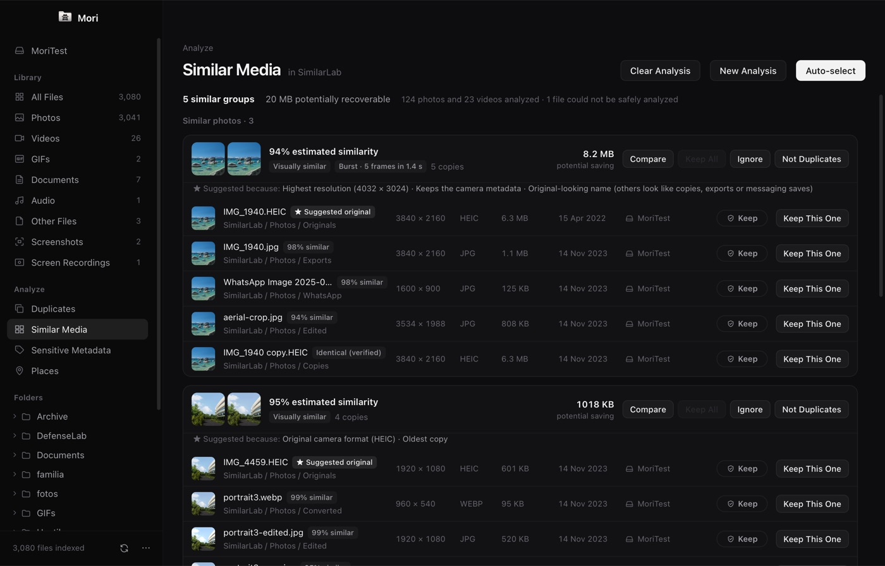
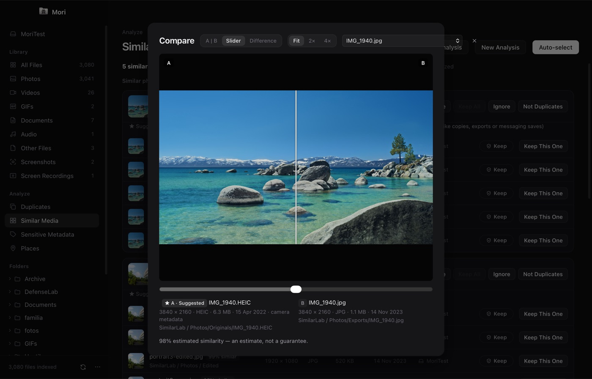
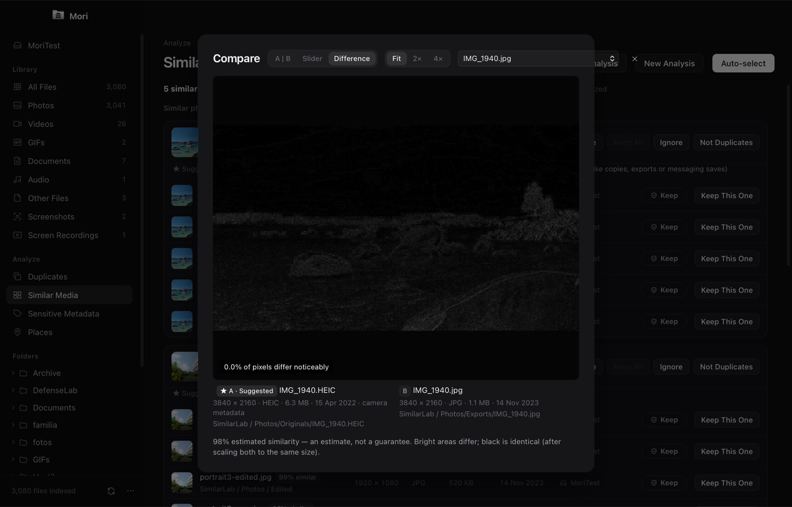

### Analysis Center, storage and media health

- **Analyze** (sidebar heading) opens the Analysis Center: every analysis in one place.
  - Each runs only when started, keeps its results in memory, and changes nothing until you review and confirm.
  - Long scans (Sensitive Metadata, Media Health) can be paused, resumed and cancelled.
- **Storage** is computed instantly from Mori's index, so no file is read:
  - totals by type and by year, and the largest files, videos, images and folders;
  - a treemap of any folder (click to drill down).
  - Private folders are shown as "not measured" and their contents aren't counted.
- **Empty Folders** lists folders without files, topmost only.
  - Each one is re-checked **on disk**, hidden items included, so a folder holding only `.git` isn't "empty". Only system clutter like `.DS_Store` is ignored.
  - Nothing is removed automatically. After review, selected folders go to the **Trash** (re-checked again right before), never deleted permanently.
- **Media Health** checks every photo, video and audio file on the drive. Each file gets at most one result:
  - **Risk-flagged**: the content contradicts the name or extension;
  - **Broken**: empty, truncated, damaged or unrecognisable;
  - **Unsupported**: real media with no safe decoder or player in Mori (RAW/TIFF, AVI, unsupported codecs);
  - **Decode failed**: the sandboxed decoder timed out, crashed or hit a safety limit.
  - Files open isolated from the results.

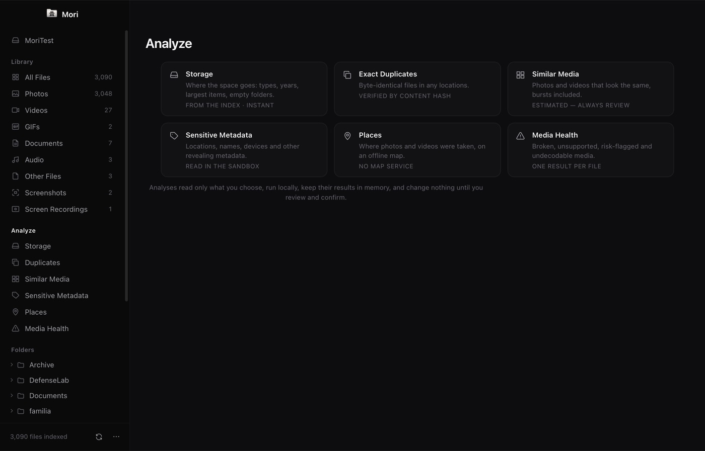
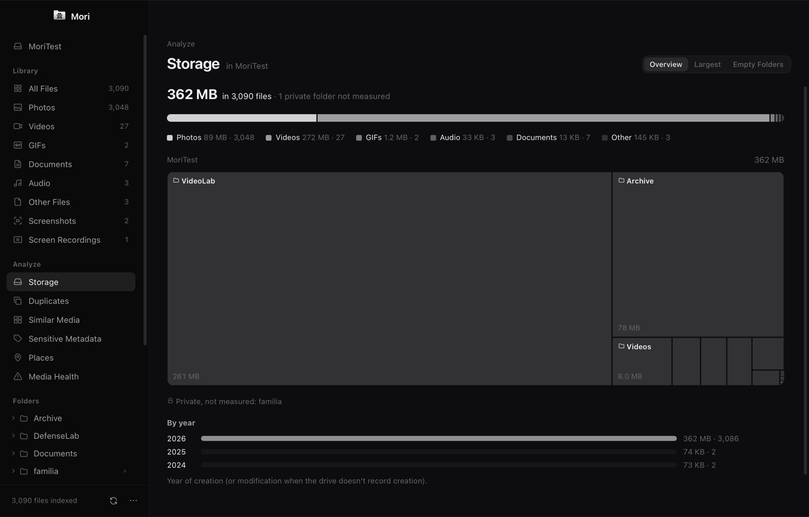
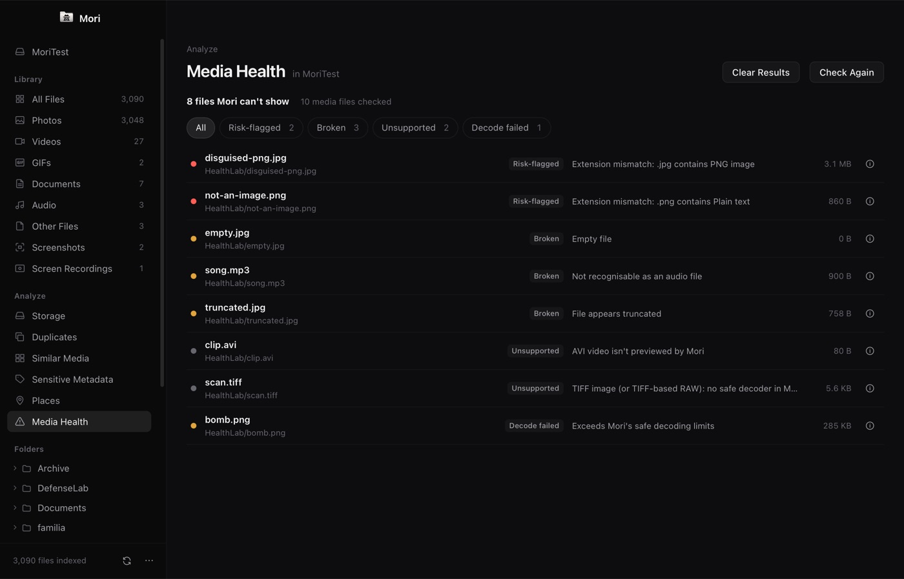

### Organization

- **Favorites** (files and folders): *Add to Favorites* in the menu, or press `F`. They're listed under Favorites in the sidebar.
- **Tags**: *Tags…* in the menu, for one item or a selection. Items can have several tags.
  - Every tag appears in the sidebar with its count.
  - **Right-click a tag in the sidebar** (or press the context-menu key / Shift+F10 on it) for **Rename Tag…** and **Delete Tag…**; right-clicking never opens the tag. **Manage Tags** also lets you search, rename and delete them.
  - **Renaming** keeps the same tag, so every tagged item keeps it under the new name, and the count stays. Names are trimmed; an empty name, more than 60 characters, or the name of another tag (in any case) is refused. Tags are never merged. Changing only the case is fine.
  - **Deleting a tag never deletes or changes a file.** It removes the tag and its associations only; the confirmation says how many items lose it ("This removes the tag from 127 items. No files are deleted or changed."). If that tag was open, Mori goes back to the drive.
  - Counts and the open tag view update immediately, and the changes are kept after restarting Mori. Not available in temporary sessions (Mori keeps no records there).
  - Favorites and tags live in Mori's app data only. Files and their metadata are never modified.
  - Like private folders, they are stored per volume, so they survive remounts.
- **Temporary Session…** (More menu) opens a folder without keeping anything; see [Private Inspection and Temporary Session](#private-inspection-and-temporary-session).
- **Forget This Drive…** removes everything Mori stores about the current drive (all its index caches, its thumbnails, and its private, protected, favorite, tag and screenshot records), then closes it.
  - **Nothing on the drive is deleted or changed.** Deletion is limited to Mori's own app directories by a guard.
  - Tag names are kept.
- **Clear Session Data…** forgets what this session holds in memory: analysis results, folders picked for analysis, recent locations and search. It is distinct from:
  - *Clear Cache* (thumbnails and indexes);
  - *Forget This Drive* (Mori's records about a drive);
  - deleting files, which none of these do.

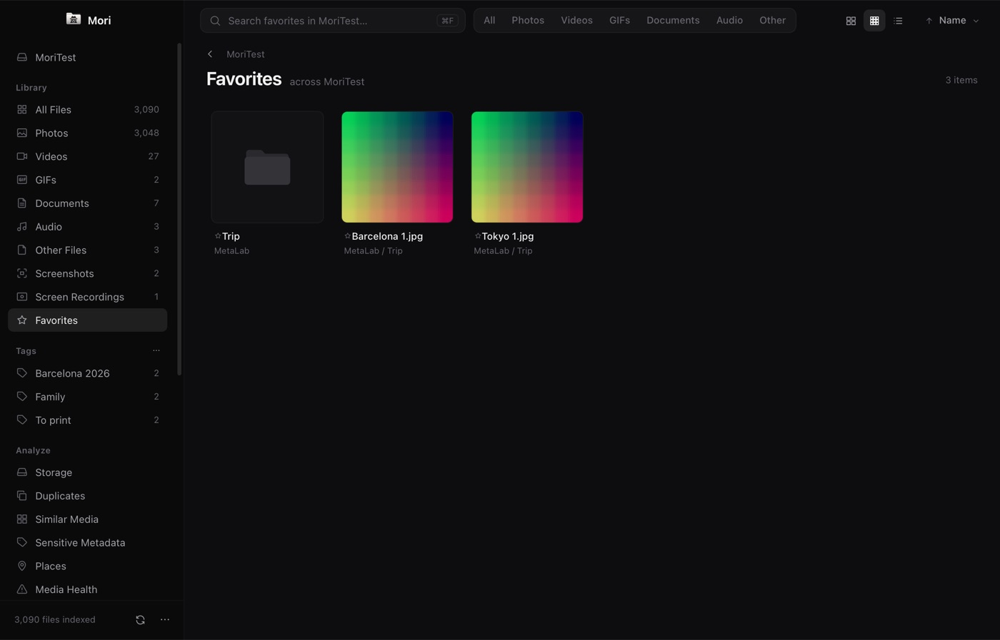
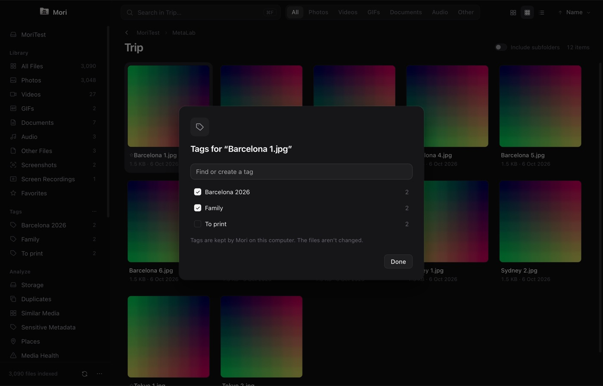
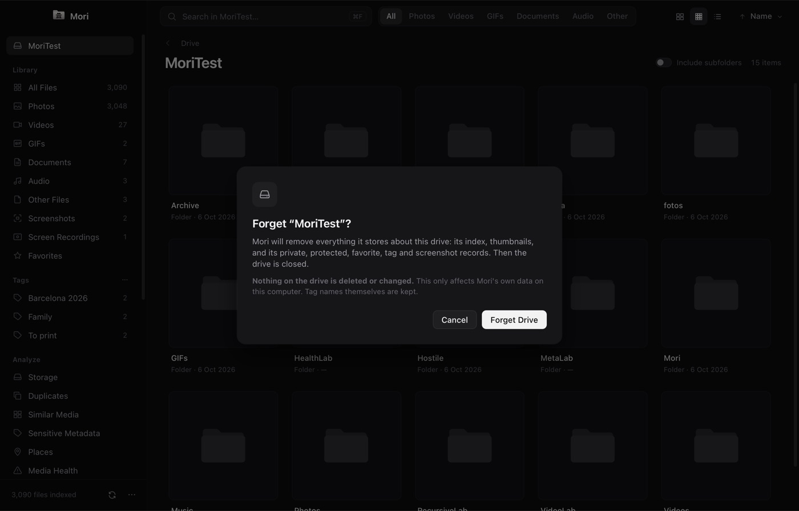

### Keyboard and viewing

| Key | Action |
|---|---|
| Click | Select (it never opens anything) |
| ⌘-Click / Ctrl+Click | Add to / remove from the selection |
| Shift-Click | Select the range from the last clicked item |
| ⌘A / Ctrl+A | Select everything in the current view |
| Arrow keys | Move the selection; with Shift, extend it |
| Double-click / Return | Open the folder or the preview |
| Space | **Mori Quick Look**: a floating preview inside Mori, never the system's Quick Look |
| Esc | Close / clear the selection |
| `M` / `⇧M` | Move to… / Copy to… (the selection, or the file being previewed) |
| F2 | Rename |
| ⌘⌫ / Delete | Move to Trash (Windows/Linux: Delete) |
| `I` | Get Info |
| `F` | Add to / remove from Favorites (or click the star on a card) |
| Drag onto a folder | Move there (Option/Alt: copy) |
| ⌘F / Ctrl+F | Search |
| ⌘K / Ctrl+K | **Command palette**: every view, analysis and action, plus files and folders by name |
| ⌘1 / ⌘2 / ⌘3 | List / Grid / Gallery |
| ← → in a preview | Previous / next file |

Shortcuts never fire while you type in a text field. *Keyboard Shortcuts* in the palette lists them all.

- **Slideshow**: the play button in the preview steps through the photos every 4 seconds. Any key or click stops it.
- **Filmstrip** under a playing video: eight frames along the video, re-encoded by the worker. Click one to jump to the moment it shows.
  - The strip has one fixed height and each frame keeps the video's **displayed** shape: a phone video (e.g. 352×640) gets narrow portrait frames, a 16:9 video wide ones. Whole frames are shown, never cropped; extreme ratios are letterboxed on black. A strip wider than the window scrolls sideways.
  - Rotated phone videos (stored landscape with 90°/270° rotation metadata) count as portrait: frames are taken from what the player displays, and the video facts report the displayed size.
- **Hover scrub**: moving the pointer across a video thumbnail shows those frames.
  - Only frames already sampled are used.
  - Lingering on a video asks for them in the background, through the thumbnail queue and never during a preview.
  - They are refused in Safe Inspection Mode.
- **Audio**: MP3, AAC/M4A, WAV, AIFF and FLAC (verified by magic bytes) play in the preview, with a waveform you can click to seek.
  - The waveform is decoded at a low sample rate, and only for files up to 32 MB.
  - Audio isn't played in the isolated view.

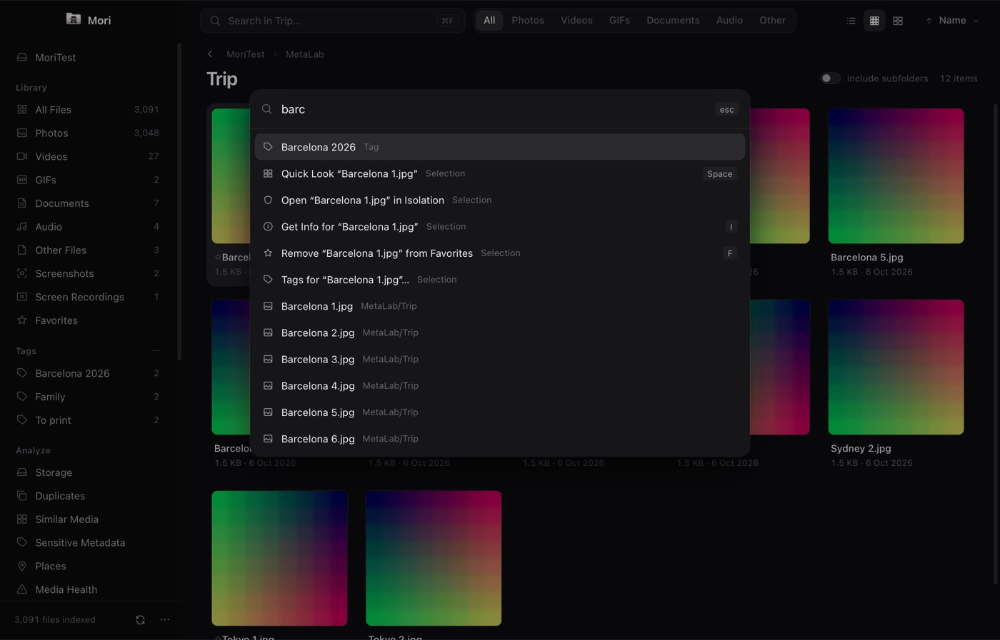
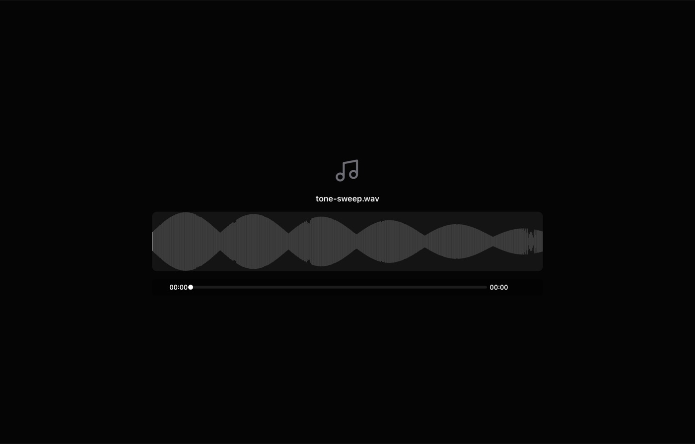
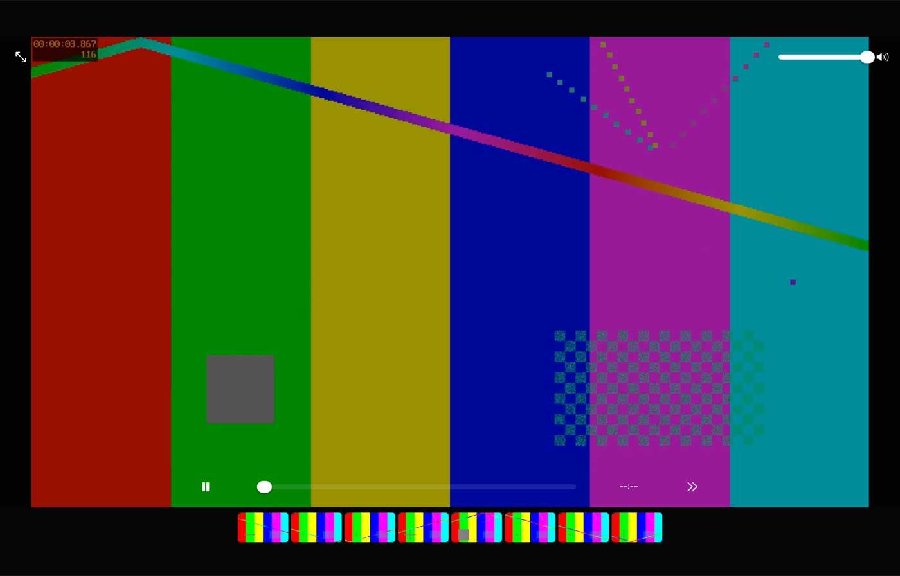

### Selection

Selection works the same in Grid, Gallery and List views, in search results and in flattened (*Include subfolders*) views, because it lives outside the views (`src/selection.ts`).

- Items are identified by Mori's opaque id, never by name: two `IMG_0001.jpg` in different folders are different items.
- Items that disappear (moved, trashed, renamed elsewhere, filtered out) leave the selection; the keyboard focus continues with the next item.
- With several items selected, a bar at the bottom shows **"N selected"** with Move to…, Copy to…, Tags…, Favorite and Move to Trash. The context menu offers the same for the whole selection.
- Only the visible tiles are rendered, and each re-renders only when its own selection state changes, so selecting in a folder of tens of thousands of files stays instant.

### Drag and drop

Drag files and folders onto a folder to move them there, like Finder. It is the same backend Move as *Move to…*: the frontend only says what goes where, and the backend checks everything again.

- **Sources**: one item, or the selection. Grabbing an item that is part of the selection drags the whole selection; grabbing an unselected item drags just that item and makes it the selection. Sidebar folders can be dragged too. The drag image shows one picture and the count ("5 items"), never a stack of thumbnails.
- **Targets**: folder cards in Grid and Gallery views, folder rows in List view, folders in the sidebar tree, and the drive itself at the top of the sidebar.
- **Feedback**: a folder that will take the drop shows Mori's selection ring and tint; one that won't is dimmed and dashed, with the reason (already there, into itself or its own subfolder, protected, Read-only Mode / Private Inspection), and the cursor shows the drop isn't allowed.
- **Sidebar auto-expand**: hold over a collapsed sidebar folder for about ¾ s and it expands, so you can go deeper before dropping. Passing over quickly expands nothing. The sidebar and the grid scroll when you drag near their edges.
- **Spring-loaded folders**: hold over a folder card for about a second and Mori opens it, so you can keep dragging into a subfolder.
- **Move by default**, **Option/Alt** copies (as in Finder).
- After the drop, everything works as in [Move to… and Copy to…](#move-to-and-copy-to): the backend's plan, the Keep Both / Replace / Skip / Cancel dialog only if a name conflicts or something is refused, moves across drives done as a verified copy with the original to the Trash, partial failures reported, and Undo.
- Only **internal** drags: Mori items onto Mori folders. Dragging files out to Finder or other apps, and dropping files from Finder into Mori, aren't supported (see [Not implemented yet](#not-implemented-yet)). A Mori drag carries only an opaque marker, never a path, so other apps receive nothing if the pointer leaves the window, and files dropped from outside are ignored.

### Favorites

- The star sits on the thumbnail's top-right corner in Grid and Gallery views (files and folders), in a small translucent disc that reads on light and dark images: **filled and always shown** for favorites, an **outline on hover** otherwise. Click it to add or remove; it never opens, selects, drags or Quick Looks the item.
- List view has a dedicated star at the end of the name, the same way.
- `F`, the context menu, the selection bar and the preview's `…` menu still work.
- **Favorites** in the sidebar lists favorite files and folders, with a count that updates at once (private folders' contents aren't counted, as everywhere).
- Favorites are Mori's own records (never written into files) and aren't saved in temporary sessions; there the star is only shown, not offered.

### Move to… and Copy to…

Files and folders, one or many, from the context menu, the selection bar, the preview's `…` menu, the command palette or `M` / `⇧M`.

- **Destination**: any folder of the browsed drive (a lazily expanded folder list; the current folder is marked), a recent destination from this session, or **Other Folder…**, chosen in the system's folder picker and kept for the session as an opaque key (the UI never handles paths).
- **Plan first.** The backend computes what will happen to each item without changing anything:
  - **refused** with the reason: Read-only Mode, a protected (Never Modify) source or destination, a folder into itself or one of its subfolders, an item that is already in that folder, an item that no longer exists;
  - **name conflicts**, including two selected items with the same name.
  If nothing needs a decision, the operation runs straight away.
- **Conflicts are never overwritten.** For each one (or *Apply to all*):
  - **Keep Both**: the new item gets a free name, Finder-style ("photo 2.jpg");
  - **Replace**: offered only when a file would replace a file and the existing one may go to the Trash. The existing file is **moved to the Trash first** (restorable), and the button says so ("Replace 2 and Move");
  - **Skip**. A conflict left undecided is skipped.
- **Moves** on the same volume are an atomic rename that fails rather than replace anything. **Across volumes** (another drive), Mori copies, checks that every file arrived complete, and then moves the original **to the Trash**. It never deletes an original permanently. If the original can't go to the Trash, both are kept and Mori says so.
- **Copies** never replace anything, recreate links as links (what a link points to is never read or copied), keep modification dates, and a copy that fails or is stopped half-way is removed again (only what that copy created).
- **Progress and Stop** for long operations; stopping finishes after the current item.
- **Partial failures are reported** item by item: moved, skipped, failed with the reason.
- **Undo** (⌘Z): a move on the same volume is moved back; a move to another drive puts the original back from the Trash and only then sends the copy to the Trash; a copy goes to the Trash; a replaced file comes back from the Trash. As everywhere, never over something that took the name meanwhile.
- **Everything follows**: the browser index, the preview (it continues with the next file), the selection, thumbnails, Exact Duplicates and Similar Media results, and Mori's own records (private folders, favorites, tags, screenshot corrections) for items moved on the same volume. Renaming a file now keeps its favorite and tags too.

### Quick Cleanup

For folders with hundreds or thousands of photos (or any files) where you want to decide quickly what goes.

Open it with **Quick Cleanup** in the folder header, *Quick Cleanup…* in a folder's context menu (also in the sidebar), or the command palette.

1. **Setup**: include subfolders or not; a type filter (All, Photos, Videos, GIFs, Documents, Audio, Other); an order (the current sort, oldest first, newest first, largest first, smallest first). The queue comes from the same index query as the browser, so **private folders inside the folder stay out**; started inside a private folder, its contents are included, as when browsing it.
2. **Review**, one file at a time with a large preview, shown exactly as in Mori's preview (the same media stage: the whole photo or video is always fitted, never cropped to fill the window), through the same safe preview paths as Mori's preview (worker-rendered images, guarded video, isolated views in Safe Inspection Mode, file facts for anything that can't be previewed). The header shows **124 / 836** and **Kept 78 · Marked 46**.
3. **Review Marked** (any time with `R`, and automatically after the last file): every item marked for Trash with its total size (**46 items marked · 2.8 GB**). Select some and **Keep Selected**, or **Keep All**, or double-click one to look at it again.
4. **Move 46 Items to Trash** asks **once** to confirm, showing anything the backend will refuse (protected, gone). Then the files go to the **system Trash** through the same command as every other Move to Trash, with one Undo for the whole batch.

**Nothing is moved, deleted or changed while you review.** Keep and Mark for Trash only record a decision in memory; files stay where they are until the final confirmation. Reaching the last file shows the summary, never a Trash operation.

| Key | Action |
|---|---|
| → or `K` | Keep, next file |
| ← or `D` or ⌫/Delete | Mark for Trash, next file (nothing is moved) |
| `U` or ⌘Z / Ctrl+Z | Undo the last decision (back to that file) |
| ↑ / `P` | Previous file, without deciding |
| ↓ / `S` | Next file, without deciding |
| Space | Play / pause a video |
| `Z`, ⌘+ / ⌘− / ⌘0 | Zoom a photo |
| `R` | Review marked items |
| Return | Start (setup screen) |
| Esc | Back / close |

Safeguards for fast input:
- A **held-down key** decides one file, not hundreds: auto-repeat is ignored. A bounced double press (under 45 ms) counts once; normal rapid alternating input all counts.
- Keys combined with ⌘/Ctrl/Alt never decide anything (⌘⌫ can't mark a file here).
- Files in a protected (Never Modify) folder show a badge and can't be marked.
- Files that disappear meanwhile (moved, trashed elsewhere, a drive rescanned or disconnected) drop out of the queue with their decisions; the session stays on the same file or the next one.
- Only the current file is decoded, plus the next two photos ahead (worker-rendered copies), and preloads that fall behind are cancelled. Nothing is preloaded in Safe Inspection Mode.

Sessions:
- In a normal session an unfinished cleanup is saved locally and can be **Resumed** or **Discarded** next time. Only the folder's opaque id, the options, the opaque ids of decided files and the position are saved: no names or paths. It is listed under *Analysis data* in Privacy & Local Data, and removed by Forget This Drive.
- In a **Temporary Session or Private Inspection the queue is never saved** (the backend refuses too): decisions live in memory, closing asks first, and ending the session discards them.
- In **Read-only Mode and Private Inspection** you can review and mark, but Move to Trash is unavailable and the reason is shown.

### File operations, undo and permanent deletion

- **Operation Preview.** Before moving several items or a folder to the Trash, or deleting permanently, Mori shows exactly what will happen: each item with its size and file count, and each item the mutation policy refuses (Read-only Mode, Never Modify), with the reason. Links are marked "only the link itself is removed". This is a dry run computed by the backend; nothing changes until you confirm.
- **Undo** (⌘Z / Ctrl+Z, and *Undo History…* in the More menu). Undo is offered only where it really works:
  - **Move to Trash** → put back where it was. macOS tells Mori where each item went in the Trash; elsewhere, use the system Trash.
  - **Rename** and **Move** → renamed or moved back (see [Move to… and Copy to…](#move-to-and-copy-to) for moves across drives and copies).
  - **Sanitized copy** → the copy goes to the Trash.
  - Undo never replaces something that has taken the original name, and it obeys Read-only Mode and protected folders.
  - **Permanent deletions are listed as "can't be undone"**, never as undoable.
  - The history lives in memory for the session. Clear Session Data clears it.
- **Delete Permanently…** (file menu) bypasses the Trash.
  - It always goes through the Operation Preview, with a clear warning.
  - Folders and large batches (over 25 items, 100 files or 1 GB) require **typing DELETE**. This is enforced in the backend too, not just the dialog.
  - Links are removed as themselves, and a link inside a deleted folder never leads Mori to its target (tested).
- **Secure Overwrite** (an option in Delete Permanently) replaces a file's bytes once with random data, forces them to the device, then deletes the file. It is offered **only where that is meaningful**:
  - on a spinning hard disk (identified through the system's device characteristics), with a file system that writes in place (HFS+, FAT/exFAT, NTFS).
  - It is **refused** on APFS (copy-on-write), SSD/flash (wear-levelling), network volumes, unidentifiable drives, files with other hard links, and links (never followed).
  - It respects Read-only Mode and protected folders.
  - Backups, snapshots, cloud copies and caches are out of reach, so Mori never calls this "forensic" or "unrecoverable". Whole-drive erasure is out of scope.
  - On a typical Mac (APFS on SSD) the option is shown disabled, with the reason.

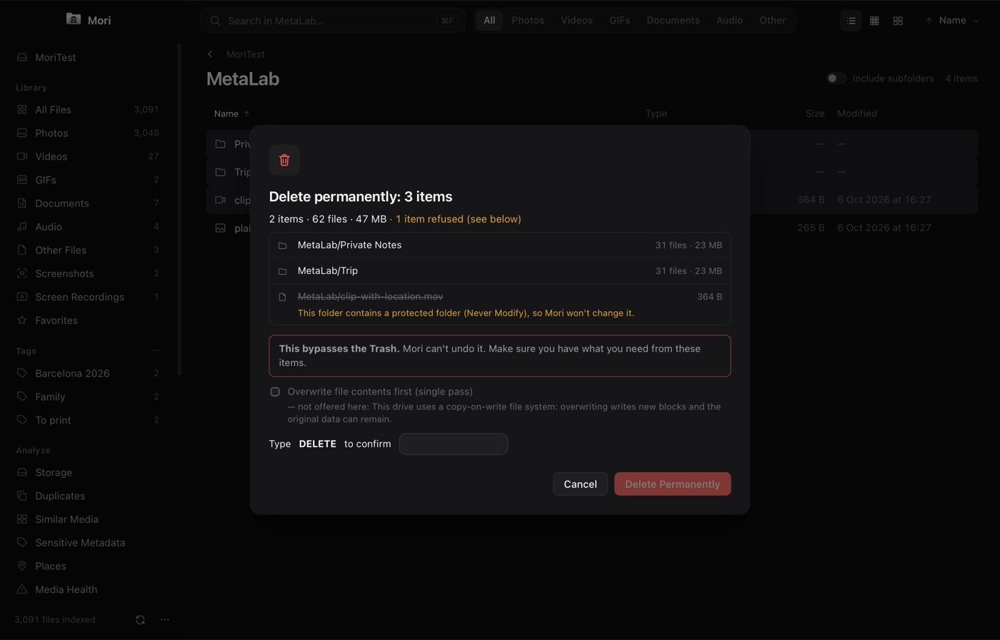
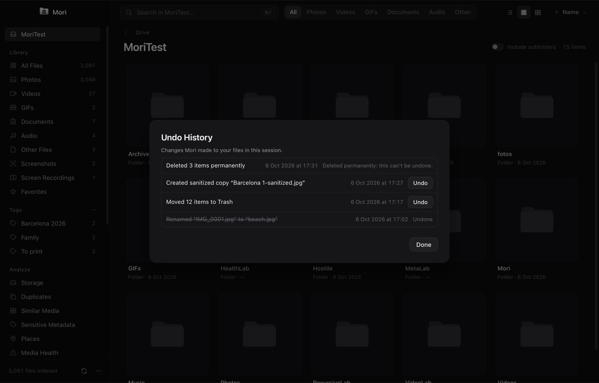

### Integrity: checksums, comparison and snapshots

- **Calculate Checksum** (file menu) computes **SHA-256** locally and shows it with the file's size, date and detected type. Copy puts it on the clipboard only when you click it. Mori never reads the clipboard.
- **Compare Integrity** (with exactly two files selected) reports **SAME CONTENT** when the SHA-256 values match, and **DIFFERENT CONTENT** otherwise. This is exact binary equality, unrelated to Similar Media: `photo.heic` and `photo.jpg` can be 97 % visually similar and still have different SHA-256 values. That is expected.
- **Checksums are cached in memory only**, for the session.
  - The cache is keyed by the file's device, inode, size, modification and change times; any change invalidates it.
  - Nothing is written to disk.
- **Save Integrity Check** (a file) and **Create Integrity Snapshot** (a folder) record relative paths, sizes and SHA-256 values in Mori's local data, never next to your files.
  - Folder snapshots skip private folders inside the chosen folder (choosing the private folder itself includes it), never follow links, and skip system clutter.
  - **Integrity Snapshots…** verifies a snapshot later: *Unchanged*, or the lists of *Changed*, *Missing* and *New* files.
  - Snapshots are opt-in local state and are refused during temporary sessions.

### Private Inspection and Temporary Session

- **Temporary Session…** (More menu, ⌘K) browses a folder with nothing kept afterwards.
  - Index, thumbnails, previews, video frames, PDF pages, metadata results, checksums, analysis results, undo history and search stay in memory.
  - Requests to save records (tags, favorites, folder rules, snapshots, drive settings, "not duplicates" decisions) are refused.
  - Opening files in other apps and revealing them in Finder are disabled, since those apps keep their own history.
- **Private Inspection…** (More menu, Welcome screen, or **Temporary Inspection** when a new drive is connected) is the one-step preset for unknown drives:
  - Read-only ✓
  - Temporary session ✓
  - Automatic decoding off (Safe Inspection Mode)
  - Persistent indexing off
  - Network required: no
  - The drive isn't remembered. *Generate previews* turns decoding on for the session only.
- **End Session** cancels running analyses and checks, and drops every in-memory result, cache and history entry of the session. It then returns to your normal folder and shows *Session cleared*.
- **The folder picker.** macOS records the last folder chosen in a folder picker in Mori's preferences. Mori removes that record after every picker, at quit and at launch.

### Diagnostics and Privacy & Local Data

- **Diagnostics…** runs a self-test on synthetic data made in memory (never your files, never the network).
  - Media: JPEG/PNG/WebP/GIF/HEIC decoding, PDF rendering.
  - Security: worker sandbox, every sandbox profile, resource limits, malformed media, type detection, archive traversal, symlinks, Read-only Mode, protected folders.
  - Network: the web view CSP, and the workers' network denial (tested on the loopback interface only).
  - Ephemeral mode, local data store and logging.
  - Each result is ✓ (verified now), △ (limited), ✕ (not working) or — (a fact about the code or configuration that can't be tested at runtime). There are no hard-coded check marks; a unit test checks that capabilities show as failing when the worker can't run.
- **Privacy & Local Data…** lists everything Mori stores, with sizes and locations. You can clear any of: cache & thumbnails, analysis data, history, tags & favorites, folder rules, integrity snapshots.
  - **Reset Mori…** (type RESET) removes all of Mori's own data.
  - None of these delete or change files on your drives.

### Private folders

Right-click a folder and choose **Make Private** to create a visibility boundary inside Mori. The folder stays where it is and opens normally, but its contents are no longer surfaced from outside it:

- **Hidden from:** All Files and the media categories, global search, sidebar counts, "Include subfolders" views of parent folders, and Exact Duplicates / Similar Media analyses started from a parent folder.
- **Normal inside:** when you open the private folder itself, browsing, search, filters and "Include subfolders" work as usual, and you can choose it directly as an analysis location. Private folders nested inside it are boundaries in turn.
- **Indicator:** a small lock marks private folders. **Make Public** restores normal behaviour immediately.

This is **not encryption** and does not modify, move, lock or change permissions on anything on disk. Nothing is written to your drive. The files remain fully visible to Finder, Explorer, other apps and anyone with access to the drive. Only Mori's own views change.

The setting is stored in Mori's app data and survives restarts. On macOS each drive is recognised by its volume UUID, so a private folder on an external drive stays private after you eject it and plug it in again, even if it mounts under another name. A private folder renamed or moved within the same drive outside Mori is recognised again on the next scan by its file ID.

### Not implemented yet

These have been discussed for Mori but **are not in the code yet**:

- **Drag and drop with other apps**: dragging files out of Mori to Finder or other apps, and dropping files from Finder into Mori. Mori's window has the system drop handler off on purpose, and Tauri 2 has no built-in way to start a native file drag. Supporting it would mean a native drag plugin that hands real paths to the system (dragging out), and turning the drop handler on, which hands arbitrary outside paths to Mori (dropping in). Both need their own security review. Internal drag and drop works.
- **Merging folders**: a folder never replaces or merges into a folder with the same name; Keep Both or Skip.
- Copying links on Windows needs Developer Mode (or administrator rights); otherwise the link is reported as not copied.

- HEIC / HEIF previews on Windows and Linux (macOS only for now).
- Apple Live Photos playback (Still / Live / Loop modes). Live Photos are recognised as pairs by the analyzers only.
- Matching heavily cropped images, or videos where a large part was cut.
- **PDF preview, new-drive detection, and Undo for Trash** are macOS-only. On Windows/Linux, PDFs show the file report, and trashed items are restored from the system Trash.
- **Sanitized copies** of HEIC/AVIF images and of videos or audio: there is no safe lossless rewrite yet, so no option is offered for them.
- **Pause/resume** for Exact Duplicates and Similar Media (they can be cancelled). Sensitive Metadata and Media Health can be paused.
- **Apple burst identifiers** (MakerNote BurstUUID). Bursts are recognised from capture times among Similar Media groups only.
- **Secure Overwrite** works only on spinning hard disks with in-place file systems, which a modern Mac (APFS on SSD) is not. There, the option is shown disabled with the reason.
- **Map tiles.** The map shows bundled world outlines only, by design: no map service is ever contacted.

## Philosophy and inspection

Mori assumes files may be untrusted. It tries to reduce your exposure to them through:

- **Local processing:** no network, no cloud, no accounts, no telemetry.
- **Restricted previews:** decoded in a sandboxed worker and shown only as re-encoded output.
- **Type verification:** the content decides what a file is, never the extension.
- **Bounded analysis:** size, time and memory limits on everything Mori reads.
- **Explicit, policy-checked destructive actions:** Read-only Mode and protected folders.
- **Privacy boundaries:** private folders.

Mori is **not** an antivirus, a malware guarantee, a perfect sandbox, or a forensic secure-erasure tool. It reports observations ("the extension says JPEG, the content is a Mach-O executable"), never verdicts like "safe" or "virus-free".

### File inspection

- **Get Info** (`I`) shows a factual report for any file, folder or link:
  - the **real type** detected from the content (about 90 formats: images, RAW, video, audio, documents, archives, executables, scripts, web content, fonts, databases) and whether the extension matches;
  - **risk indicators** with the reason for each (Info / Attention / High attention);
  - dates, and **permissions** (mode, owner, group, setuid/setgid, macOS filesystem flags, ACL entry count, extended attribute names).
- **Risk indicators** are objective anomalies:
  - executable content disguised as media or documents, double extensions (`invoice.pdf.app`), direction-control characters in names, padded names;
  - unknown signatures where a known format is expected;
  - extreme declared image dimensions and compression ratios (read from the header, nothing decoded), truncated JPEG/PNG/GIF/PDF;
  - the executable bit on media, the macOS quarantine attribute, previous decode failures, videos that previously hung the media engine.

  Names with a high-attention pattern get a small warning mark in the file list.
- **Symbolic links** are listed and described (where they point, and whether that is outside the folder). They are **never followed**: not when browsing, scanning, searching, analysing or opening. A link to `/` or a link loop cannot pull anything into Mori.

### Open in Isolation

- **Open in Isolation** (file menu) shows a file using only copies made by Mori's sandboxed worker. The original is never opened in another app, never run, and the view has no *Open* button.
  - Images: the worker's re-encoded copy.
  - Videos: eight still frames sampled across the video, each re-encoded by the worker. No player is shown. (The frames are decoded by the system web view's own sandboxed media engine, under the same probe, blocklist and watchdog as normal playback.)
  - PDFs: pages rasterised by the worker (see below).
  - Text: plain text. Archives: a listing.
  - Anything else: *Preview unavailable* plus the factual report (detected type, extension check, findings). There is never a fallback to the original.

### Safe Inspection Mode (new drives)

- When a drive Mori has never seen is connected while Mori runs, Mori offers **Inspect Safely with Mori**.
- A drive opened that way is indexed from filesystem metadata only (names, sizes, dates; the scanner never reads file contents), and **nothing is decoded automatically**: thumbnails, previews and video frames are refused by the backend. A banner shows *SAFE INSPECTION MODE · Files indexed N · Media decoded N*.
- Opening a file is an explicit request and always shows it isolated.
- **Generate previews** allows automatic thumbnails for that drive (remembered per volume UUID). **Browse metadata only** keeps it as it is and collapses the banner.

### PDF preview

- Pages are rendered to bitmaps by macOS CoreGraphics **inside the sandboxed worker**, with page thumbnails, page navigation (Page Up / Page Down) and zoom.
- Nothing interactive exists: no JavaScript, actions, links, forms, attachments or network. Their presence is reported ("Contains JavaScript, automatic actions… — not run").
- Encrypted (locked) or unreadable PDFs show *Preview unavailable* and the file report. PDF preview is macOS-only for now.

### Archive inspection

- ZIP (and JAR, Office Open XML, OpenDocument, EPUB), TAR and gzip / tar.gz are **listed, never extracted**: names, sizes, compressed sizes, links, encryption.
- Flags per entry: `../` traversal, absolute or drive-letter paths, hidden characters, nested archives, extreme compression. Archive-level findings: zip-bomb ratios, too many entries, nesting depth.
- Limits: 200,000 entries, 5,000 listed, 3 nesting levels (nested archives up to 64 MB are listed in memory), 512 MB total inflation for gzip/nested data, 20 s.

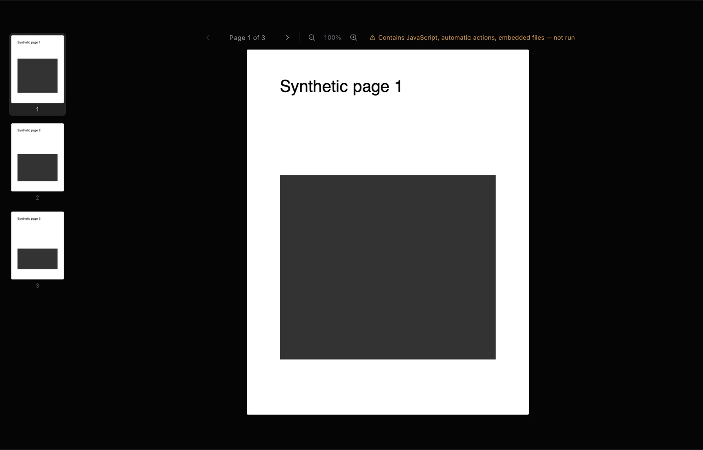
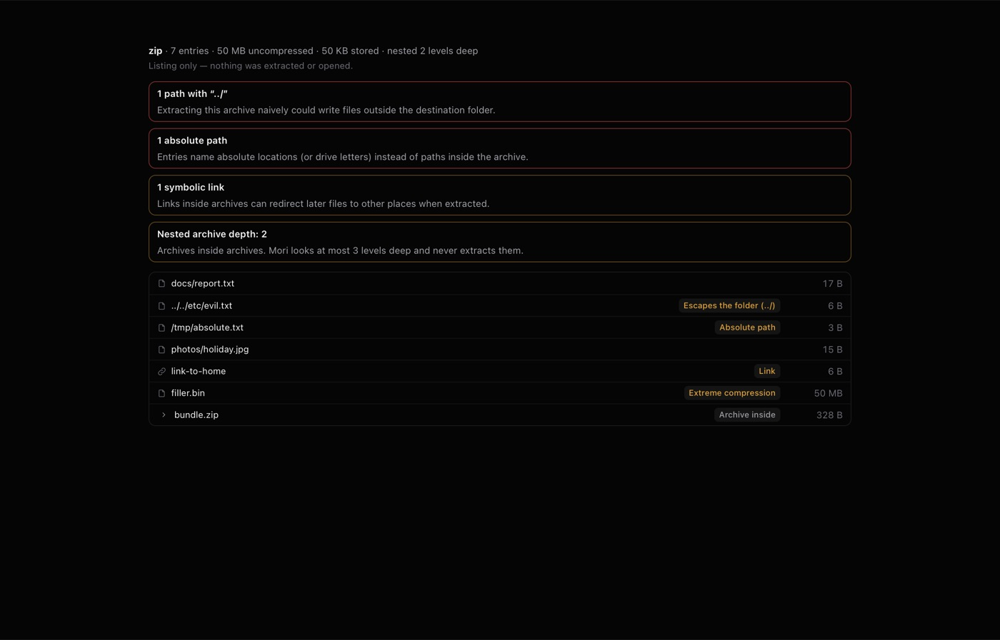

### Metadata

- **Get Info → Metadata** lists what a file carries: EXIF, XMP, IPTC, QuickTime/MP4 atoms (including Apple's location and device keys), ID3v2 tags and FLAC Vorbis comments.
  - The default view shows the revealing fields. **Show all metadata** lists everything, grouped.
  - Fields are tagged as Location, People & authors, Device, Software, Comments & descriptions, or Unique IDs.
- **Analyze → Sensitive Metadata** scans photos, videos and audio in chosen locations and lists the files carrying such fields.
  - Filter by category; pause, resume or cancel the scan.
  - Private folders inside the chosen locations are skipped.
  - Results stay in memory only.
- **Places** shows every position found on an **offline map**.
  - Bundled Natural Earth land outlines, clustering, zoom and pan.
  - No tiles are loaded and no coordinates are sent anywhere (Google, Apple, Mapbox, OpenStreetMap or any other service).
- **Create Sanitized Copy** (inspector, or for a selection in Sensitive Metadata) writes `name-sanitized.jpg` next to the original.
  - Same pixels, no metadata. Only the orientation is kept, so the copy isn't shown rotated.
  - JPEG, PNG and WebP up to 60 MB.
  - The original is never modified. Mori never strips metadata in place.
  - Each copy is verified **before** it is written: it decodes to the same dimensions and a fresh metadata read finds nothing left.
  - It is then written with create-new semantics (never replacing a file, never through a symlink) and read back.
  - Read-only Mode and Never Modify folders refuse it.

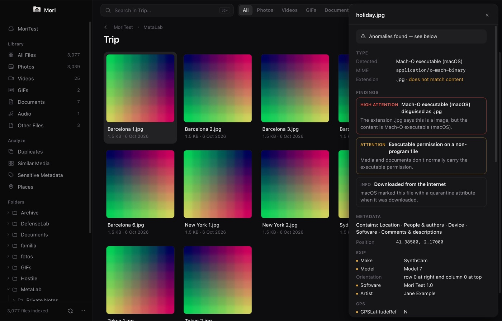
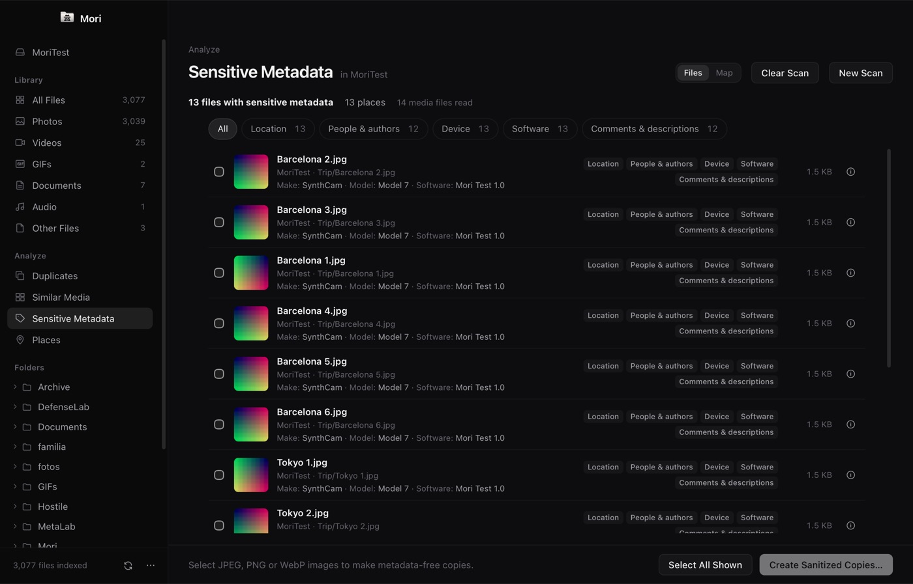
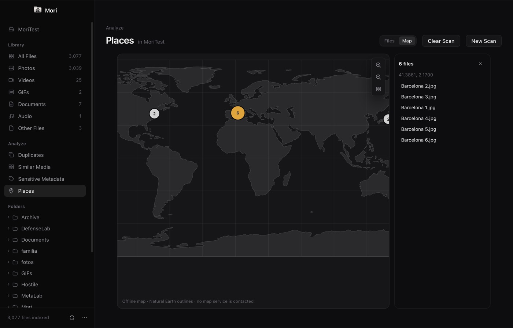

### Read-only Mode and protected folders

- **Read-only Mode** (More menu) makes Mori refuse every change to your files: rename, Trash, and every future destructive operation.
- **Never Modify** (folder menu) protects a folder: Mori refuses to change anything inside it, or any folder that contains it. Browsing and analysis stay available. Removing protection asks for confirmation. Protected folders use the same per-volume identity as private folders (they survive restarts, remounts and moves within the drive).
- **Enforcement is in the backend.** Every filesystem mutation function requires the mutation policy and checks it first, so a UI bug can't bypass it.

## Security design

Mori treats every file on a drive as **untrusted input**. It is designed to reduce the impact of malicious media. It does not and cannot guarantee that a crafted file is harmless. The design is built around:

- **Untrusted media.** File types are decided by magic bytes, never by extension, and disguised files are flagged and never handed to another app.
- **Isolated processing.**
  - Images are decoded in a separate, short-lived worker process with memory-safe Rust decoders.
  - On macOS the worker runs inside the system sandbox with no file or network access. HEIC/HEIF is decoded by macOS's own decoder inside a dedicated, equally closed profile that may only talk to Apple's sandboxed video-decoder service.
  - The worker receives bytes, never paths.
- **Sanitized previews.** The UI only shows freshly re-encoded images produced by the worker. Video containers and codecs are probed before playback, and only codecs known to work with the system player are streamed.
- **Least privilege and minimal IPC.**
  - The UI has no filesystem access and works with opaque file IDs.
  - Each IPC command is allow-listed individually.
  - Every path is canonicalized and confined to the selected folder, and symlinks are never followed.
- **No networking.** A strict Content-Security-Policy blocks every remote origin, and the Rust side has no network code.
- **Conservative file changes.**
  - Browsing and analysis are read-only.
  - The changes Mori can make are: a rename (which never overwrites an existing item), moving items to the system Trash or back, creating sanitized copies (never replacing a file), and — only after the Operation Preview and explicit confirmation — permanent deletion with optional Secure Overwrite where meaningful. Each one runs only as an explicit user action.
  - Symlinks are never followed or acted on.
  - Both analyzers read only the folders you select. A folder picked with *Choose a Folder…* is remembered only for the current session.
- **Resource limits.**
  - Decoders have pixel, memory, input-size and time limits.
  - At most three workers run at once.
  - Video is streamed in bounded chunks, never loaded whole.
- **Graceful decoder failure.**
  - A crashed, hung or over-limit decoder only fails that one preview ("This video could not be safely previewed").
  - If the system video engine hangs or crashes, Mori restarts the web view and blocks that file from being loaded again.

The full design, limits and platform caveats are described in [docs/security.md](security.md).

## Branding

Mori's mark is a folder with a pixel-art incognito character, in two variants:
- **Dark folder with a light character:** the primary mark and the app icon. It is used on light UI backgrounds.
- **Light folder with a dark character:** used on dark UI backgrounds.

All icons are generated from the original artwork by `python3 scripts/build-icons.py` (needs Pillow, NumPy and macOS `iconutil`). The original full-resolution artwork lives in `assets/branding/source/` and is not committed.
- **macOS:** the icon follows Apple's icon grid (a squircle with transparent margins), so macOS 26 doesn't shrink it onto a grey plate.
- **Windows and Linux:** the icons are the free-form folder.
- **16–48 px:** these sizes get a tighter crop and light sharpening so the character stays recognisable.
